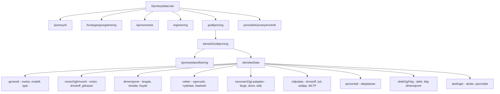
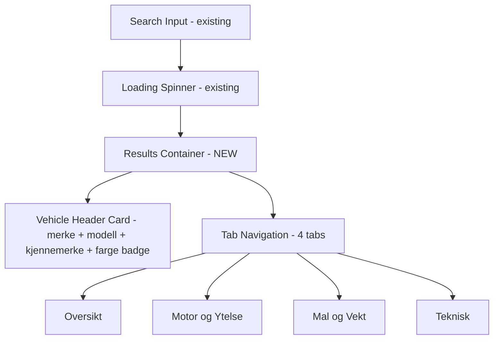

# Enhanced Vehicle Data & UI Plan

## Current State Analysis

### What exists today
The app currently fetches vehicle data from Statens Vegvesen's API via a Vercel serverless function (`api/getRegNummer.ts`) and displays only **4 fields** in a simple table:

| Field | Source |
|-------|--------|
| Kjennemerke (plate) | `kjoretoyId.kjennemerke` |
| Førstegangsregistrering | `forstegangsregistrering.registrertForstegangNorgeDato` |
| Eierregistrering | *(appears in HTML but not actually returned from API)* |
| Sist EU-kontrollert | `periodiskKjoretoyKontroll.sistGodkjent` |

### Key issues found
1. **Missing type**: `IStatensVegvesenBilData` is imported in `classProcessInputForm.ts` and `classErrorHandler.ts` but **not defined** in `typeDefinitions.ts` — only `IStatensVegvesenFullData` exists
2. The API returns a **massive amount of data** that is completely ignored
3. The UI is a single row table — very limited

---

## Available API Data (from Swagger / `schema.json`)

The `GET /enkeltoppslag/kjoretoydata` endpoint returns a `KjoretoydataResponse` with `kjoretoydataListe[]`, each containing:

---

## Plan: 4-Tab Data Layout

We will organize the vehicle data into **4 focused tabs** displayed in a tabbed card UI:

### Tab 1: Oversikt (Overview)
Key identity and registration info at a glance.

| Label | Data path |
|-------|-----------|
| Kjennemerke | `kjoretoyId.kjennemerke` |
| Understellsnummer | `kjoretoyId.understellsnummer` |
| Merke | `tekniskeData.generelt.merke[0].merke` |
| Modell | `tekniskeData.generelt.handelsbetegnelse[0]` |
| Typebetegnelse | `tekniskeData.generelt.typebetegnelse` |
| Farge | `tekniskeData.karosseriOgLasteplan.rFarge[0].kodeBeskrivelse` |
| Kjøretøyklasse | `kjoretoyklassifisering.beskrivelse` |
| Førstegangsregistrering | `forstegangsregistrering.registrertForstegangNorgeDato` |
| Registreringsstatus | `registrering.registreringsstatus.kodeBeskrivelse` |
| Kjøringens art | `registrering.kjoringensArt.kodeBeskrivelse` |
| Neste EU-kontroll | `periodiskKjoretoyKontroll.kontrollfrist` |
| Sist godkjent EU-kontroll | `periodiskKjoretoyKontroll.sistGodkjent` |

### Tab 2: Motor & Ytelse (Engine & Performance)
Engine specs merged with fuel/emissions data.

| Label | Data path |
|-------|-----------|
| Drivstofftype | `miljodata.miljoOgdrivstoffGruppe[0].drivstoffKodeMiljodata.kodeBeskrivelse` |
| Motoreffekt kW | `motor[0].drivstoff[0].maksNettoEffekt` |
| Slagvolum cc | `motor[0].slagvolum` |
| Antall sylindre | `motor[0].antallSylindre` |
| Girkassetype | `motorOgDrivverk.girkassetype.kodeBeskrivelse` |
| Antall gir | `motorOgDrivverk.antallGir` |
| Hybrid-kategori | `motorOgDrivverk.hybridKategori.kodeBeskrivelse` |
| Maks hastighet km/t | `motorOgDrivverk.maksimumHastighet[0]` |
| Euro-klasse | `miljodata.euroKlasse.kodeBeskrivelse` |
| CO2 blandet kjøring g/km | `forbrukOgUtslipp[0].co2BlandetKjoring` |
| Forbruk blandet kjøring l/100km | `forbrukOgUtslipp[0].forbrukBlandetKjoring` |
| NOx utslipp mg/km | `forbrukOgUtslipp[0].utslippNOxMgPrKm` |
| Partikkelfilter | `forbrukOgUtslipp[0].partikkelfilterFabrikkmontert` |
| Rekkevidde km (EV) | `forbrukOgUtslipp[0].rekkeviddeKm` |
| Støynivå dB | `miljodata.miljoOgdrivstoffGruppe[0].lyd.standstoy` |

### Tab 3: Mål & Vekt (Dimensions & Weight)
Physical measurements, weight, and passenger capacity.

| Label | Data path |
|-------|-----------|
| Lengde mm | `dimensjoner.lengde` |
| Bredde mm | `dimensjoner.bredde` |
| Høyde mm | `dimensjoner.hoyde` |
| Egenvekt kg | `vekter.egenvekt` |
| Nyttelast kg | `vekter.nyttelast` |
| Tillatt totalvekt kg | `vekter.tillattTotalvekt` |
| Tillatt taklast kg | `vekter.tillattTaklast` |
| Tillatt tilhengervekt m/brems kg | `vekter.tillattTilhengervektMedBrems` |
| Tillatt tilhengervekt u/brems kg | `vekter.tillattTilhengervektUtenBrems` |
| Tillatt vogntogvekt kg | `vekter.tillattVogntogvekt` |
| Sitteplasser totalt | `persontall.sitteplasserTotalt` |
| Sitteplasser foran | `persontall.sitteplasserForan` |
| Antall dører | `karosseriOgLasteplan.antallDorer[0]` |
| Kjøreside | `karosseriOgLasteplan.kjoringSide` |

### Tab 4: Teknisk (Technical Details)
Tires, axles, and EU control details.

| Label | Data path |
|-------|-----------|
| Antall aksler | `akslinger.antallAksler` |
| Dekkdimensjon foran | `dekkOgFelg.akselDekkOgFelgKombinasjon[0].akselDekkOgFelg[0].dekkdimensjon` |
| Felgdimensjon foran | `dekkOgFelg.akselDekkOgFelgKombinasjon[0].akselDekkOgFelg[0].felgdimensjon` |
| Hastighetskode dekk | `dekkOgFelg.akselDekkOgFelgKombinasjon[0].akselDekkOgFelg[0].hastighetskodeDekk` |
| Dekkdimensjon bak | `dekkOgFelg.akselDekkOgFelgKombinasjon[0].akselDekkOgFelg[1].dekkdimensjon` |
| Felgdimensjon bak | `dekkOgFelg.akselDekkOgFelgKombinasjon[0].akselDekkOgFelg[1].felgdimensjon` |
| Sporvidde foran mm | `akslinger.akselGruppe[0].akselListe.aksel[0].sporvidde` |
| Sporvidde bak mm | `akslinger.akselGruppe[1].akselListe.aksel[0].sporvidde` |
| Tilhengerkopling | `tilhengerkopling.kopling[0]` (if present) |

---

## UI Design: Tabbed Card Layout

### UI Components
- **Vehicle Header Card**: A prominent card at the top showing brand, model, plate number, and color as a colored badge
- **Bootstrap Nav Tabs**: 4 clean tabs — responsive, collapses to scrollable on mobile
- **Data Tables per Tab**: Each tab contains a clean two-column table (label + value)
- **Conditional rendering**: Hide fields when data is not available (many fields are optional)
- **Animate.css**: Fade-in animation on tab content (already in project)

---

## Architecture Changes

### 0. OpenAPI Spec Reference (`schema.json`)
- Already saved locally at project root as `schema.json`
- Contains all schema definitions, endpoint details, and field descriptions for reference

### 1. Type Definitions (`scripts/types/typeDefinitions.ts`)
- Add the missing `IStatensVegvesenBilData` interface for the **simplified frontend response**
- Create a new `IVehicleData` interface with 4 sections matching the tabs:
  - `oversikt`: identity + registration fields
  - `motorOgYtelse`: engine + emissions fields
  - `malOgVekt`: dimensions + weight + seats
  - `teknisk`: tires + axles + EU control

### 2. API Serverless Function (`api/getRegNummer.ts`)
- Extract all fields listed in the 4 tabs above from the API response
- Sanitize all string values with DOMPurify
- Structure response into the 4 sections
- Handle optional/missing fields gracefully with null/undefined checks
- Return `null` for fields that don't exist instead of crashing

### 3. HTML (`index.html`)
- Keep existing search form
- Replace simple table with a results container containing:
  - Vehicle header card (brand + model + plate + color badge)
  - Bootstrap nav-tabs with 4 tab panes
  - Each tab pane contains a styled two-column data table
- All results hidden by default via `d-none`

### 4. SCSS (`scss/bootstrap.scss`)
- Add custom styles for vehicle header card
- Color badge for vehicle color
- Tab styling enhancements
- Responsive adjustments for mobile

### 5. Frontend Logic Updates
- **`classProcessInputForm.ts`**: Refactor `addDataToTable` to populate all 4 tab sections dynamically
- **`classShowHideElements.ts`**: Add show/hide for new results container
- **`classFetchRemoteData.ts`**: Minor updates to handle larger response
- **`classErrorHandler.ts`**: Better error display in context of the new UI

---

## File Change Summary

| File | Action | Description |
|------|--------|-------------|
| `scripts/types/typeDefinitions.ts` | Modify | Add `IStatensVegvesenBilData` and new `IVehicleData` response type with 4 sections |
| `api/getRegNummer.ts` | Modify | Extract ~40 fields, structure into 4 sections, sanitize all |
| `index.html` | Modify | Replace table with vehicle header card + 4-tab UI |
| `scss/bootstrap.scss` | Modify | Add custom styles for vehicle data cards and tabs |
| `scripts/classes/ProcessInputForm/classProcessInputForm.ts` | Modify | Render data to all 4 tab sections |
| `scripts/classes/ProcessInputForm/classShowHideElements.ts` | Modify | Handle new UI container visibility |
| `scripts/classes/ProcessInputForm/classFetchRemoteData.ts` | Minor | Adjust for expanded response |
| `scripts/classes/ErrorHandler/classErrorHandler.ts` | Modify | Update error display for new layout |
