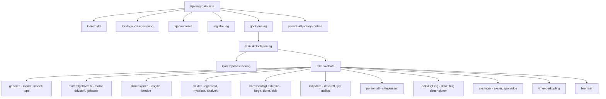
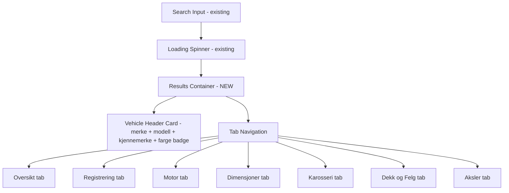

# Enhanced Vehicle Data & UI Plan

## Current State Analysis

### What exists today
The app currently fetches vehicle data from Statens Vegvesen's API via a Vercel serverless function (`api/getRegNummer.ts`) and displays only **4 fields** in a simple table:

| Field | Source |
|-------|--------|
| Kjennemerke (plate) | `kjoretoyId.kjennemerke` |
| Førstegangsregistrering | `forstegangsregistrering.registrertForstegangNorgeDato` |
| Eierregistrering | *(appears in HTML but not actually returned from API)* |
| Sist EU-kontrollert | `periodiskKjoretoyKontroll.sistGodkjent` |

### Key issues found
1. **Missing type**: `IStatensVegvesenBilData` is imported in `classProcessInputForm.ts` and `classErrorHandler.ts` but **not defined** in `typeDefinitions.ts` — only `IStatensVegvesenFullData` exists
2. The API returns a **massive amount of data** that is completely ignored
3. The UI is a single row table — very limited

---

## Available API Data (from Swagger)

The `GET /enkeltoppslag/kjoretoydata` endpoint returns a `KjoretoydataResponse` with `kjoretoydataListe[]`, each containing:

### Data categories available in the API response:

---

## Plan: Data to Extract & Display

We will organize the vehicle data into **7 logical sections** displayed in a tabbed/card UI:

### Section 1: Oversikt (Overview)
- Kjennemerke (license plate)
- Understellsnummer (VIN/chassis number)
- Merke (brand) — from `generelt.merke[0].merke`
- Modell/Handelsbetegnelse — from `generelt.handelsbetegnelse[0]`
- Typebetegnelse — from `generelt.typebetegnelse`
- Farge — from `karosseriOgLasteplan.rFarge[0].kodeBeskrivelse` or `.kodeNavn`
- Kjøretøyklasse beskrivelse — from `kjoretoyklassifisering.beskrivelse`

### Section 2: Registrering (Registration)
- Førstegangsregistrering Norge — from `forstegangsregistrering.registrertForstegangNorgeDato`
- Registreringsstatus — from `registrering.registreringsstatus.kodeBeskrivelse`
- Kjøringens art — from `registrering.kjoringensArt.kodeBeskrivelse`
- Neste EU-kontroll frist — from `periodiskKjoretoyKontroll.kontrollfrist`
- Sist godkjent EU-kontroll — from `periodiskKjoretoyKontroll.sistGodkjent`

### Section 3: Motor & Drivverk (Engine & Drivetrain)
- Drivstofftype — from `miljodata.miljoOgdrivstoffGruppe[0].drivstoffKodeMiljodata.kodeBeskrivelse`
- Motoreffekt (kW) — from `motor[0].drivstoff[0].maksNettoEffekt`
- Slagvolum (cc) — from `motor[0].slagvolum`
- Antall sylindre — from `motor[0].antallSylindre`
- Girkassetype — from `motorOgDrivverk.girkassetype.kodeBeskrivelse`
- Hybrid-kategori — from `motorOgDrivverk.hybridKategori.kodeBeskrivelse`
- Maks hastighet — from `motorOgDrivverk.maksimumHastighet[0]`

### Section 4: Dimensjoner & Vekt (Dimensions & Weight)
- Lengde (mm) — from `dimensjoner.lengde`
- Bredde (mm) — from `dimensjoner.bredde`
- Egenvekt (kg) — from `vekter.egenvekt`
- Nyttelast (kg) — from `vekter.nyttelast`
- Tillatt totalvekt (kg) — from `vekter.tillattTotalvekt`
- Tillatt taklast (kg) — from `vekter.tillattTaklast`
- Tillatt tilhengervekt m/brems — from `vekter.tillattTilhengervektMedBrems`
- Tillatt tilhengervekt u/brems — from `vekter.tillattTilhengervektUtenBrems`
- Tillatt vogntogvekt — from `vekter.tillattVogntogvekt`

### Section 5: Sitteplasser & Karosseri (Seats & Body)
- Sitteplasser totalt — from `persontall.sitteplasserTotalt`
- Sitteplasser foran — from `persontall.sitteplasserForan`
- Antall dører — from `karosseriOgLasteplan.antallDorer[0]`
- Dør-utforming — from `karosseriOgLasteplan.dorUtforming[0]`
- Kjøreside — from `karosseriOgLasteplan.kjoringSide`

### Section 6: Miljø & Forbruk (Environment & Consumption)
- Euro-klasse — from `miljodata.euroKlasse.kodeBeskrivelse`
- CO2 blandet kjøring (g/km) — from `forbrukOgUtslipp[0].co2BlandetKjoring`
- CO2 bykjøring — from `forbrukOgUtslipp[0].co2Bykjoring`
- CO2 landeveiskjøring — from `forbrukOgUtslipp[0].co2Landeveiskjoring`
- Forbruk blandet kjøring (l/100km) — from `forbrukOgUtslipp[0].forbrukBlandetKjoring`
- Forbruk bykjøring — from `forbrukOgUtslipp[0].forbrukBykjoring`
- Forbruk landeveiskjøring — from `forbrukOgUtslipp[0].forbrukLandeveiskjoring`
- NOx utslipp (mg/km) — from `forbrukOgUtslipp[0].utslippNOxMgPrKm`
- Partikkelfilter — from `forbrukOgUtslipp[0].partikkelfilterFabrikkmontert`
- El energiforbruk — from `forbrukOgUtslipp[0].elEnergiforbruk`
- Rekkevidde km — from `forbrukOgUtslipp[0].rekkeviddeKm`
- WLTP CO2 kombinert — from `wltpKjoretoyspesifikk.co2Kombinert`
- WLTP forbruk kombinert — from `wltpKjoretoyspesifikk.forbrukKombinert`
- WLTP rekkevidde blandet kjøring — from `wltpKjoretoyspesifikk.rekkeviddeKmBlandetkjoring`
- Støynivå (standstøy dB) — from `lyd.standstoy`

### Section 7: Dekk & Felg (Tires & Wheels)
- Per axle: dekkdimensjon, felgdimensjon, belastningskode, hastighetskode, innpress

### Section 8: Aksler (Axles)
- Antall aksler — from `akslinger.antallAksler`
- Per axle group: egenvekt, teknisk tillatt last, sporvidde, drivaksel info

---

## UI Design: Tabbed Card Layout

### UI Components
- **Vehicle Header Card**: A prominent card at the top showing brand, model, plate number, and color as a visual badge
- **Bootstrap Nav Tabs**: 7 tabs for each data category, responsive — collapses to a scrollable tab bar on mobile
- **Data Tables per Tab**: Each tab contains a clean two-column table with labels and values
- **Conditional rendering**: Hide sections/fields when data is not available (some fields are optional)
- **Animate.css**: Fade-in animation on tab content (already in project)

---

## Architecture Changes

### 0. Save OpenAPI Spec (`docs/openapi.json`)
- Fetch the full OpenAPI 3.1.0 spec from `https://akfell-datautlevering.atlas.vegvesen.no/v3/api-docs/Default`
- Save as `docs/openapi.json` for reference during implementation
- This contains all schema definitions, endpoint details, and field descriptions

### 1. Type Definitions (`scripts/types/typeDefinitions.ts`)
- Add the missing `IStatensVegvesenBilData` interface for the **simplified frontend response**
- Create a new expanded `IVehicleData` interface with all 7 sections

### 2. API Serverless Function (`api/getRegNummer.ts`)
- Extract all fields listed above from the API response
- Sanitize all string values with DOMPurify
- Structure response into the 7 sections
- Handle optional/missing fields gracefully with null checks

### 3. HTML (`index.html`)
- Keep existing search form
- Replace simple table with a results container containing:
  - Vehicle header card
  - Bootstrap nav-tabs with 7 tab panes
  - Each tab pane contains a styled data table
- All results hidden by default via `d-none`

### 4. SCSS (`scss/bootstrap.scss`)
- Add custom styles for vehicle header card
- Color badge for vehicle color
- Tab styling enhancements
- Responsive adjustments

### 5. Frontend Logic Updates
- **`classProcessInputForm.ts`**: Refactor `addDataToTable` to populate all 7 sections dynamically
- **`classShowHideElements.ts`**: Add show/hide for new results container
- **`classFetchRemoteData.ts`**: Minor updates to handle larger response
- **`classErrorHandler.ts`**: Better error display in context of the new UI

---

## File Change Summary

| File | Action | Description |
|------|--------|-------------|
| `scripts/types/typeDefinitions.ts` | Modify | Add `IStatensVegvesenBilData` and new `IVehicleData` response type |
| `api/getRegNummer.ts` | Modify | Extract 40+ fields, structure into 7 sections, sanitize all |
| `index.html` | Modify | Replace table with tabbed card UI |
| `scss/bootstrap.scss` | Modify | Add custom styles for vehicle data cards and tabs |
| `scripts/classes/ProcessInputForm/classProcessInputForm.ts` | Modify | Render data to all 7 tab sections |
| `scripts/classes/ProcessInputForm/classShowHideElements.ts` | Modify | Handle new UI container visibility |
| `scripts/classes/ProcessInputForm/classFetchRemoteData.ts` | Minor | Adjust for expanded response |
| `scripts/classes/ErrorHandler/classErrorHandler.ts` | Modify | Update error display for new layout |
